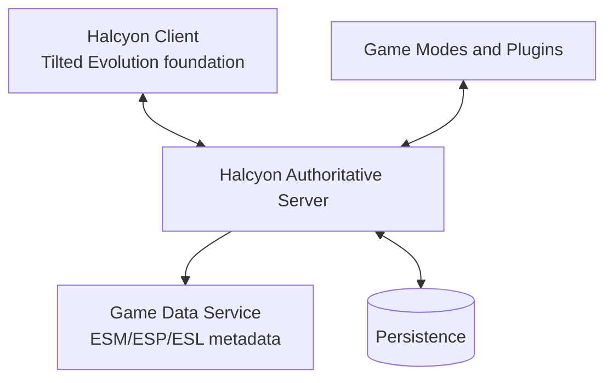

# HTDS-001 — Executive Summary

| Field | Value |
| --- | --- |
| Document ID | HTDS-001 |
| Title | Executive Summary |
| Version | 0.1.0 |
| Status | Draft |

## Summary

Halcyon is an open-source Skyrim multiplayer platform derived from the Linux/Proton fork of Tilted Evolution.

The project preserves the existing Skyrim Together Reborn client integration and cooperative synchronization while redesigning the server toward an authoritative, persistent, context-oriented architecture.

## Core proposition

Halcyon separates multiplayer state into Contexts.

A Context identifies the logical scope in which state is authoritative and visible. The same server may contain:

- a global physical world;
- personal narrative progress;
- party-owned quest progress;
- temporary narrative instances;
- public runtime events;
- instanced dungeons;
- bounty contracts.

Two players can occupy the same geographic area, see one another, communicate, trade, or fight while remaining unable to interfere with unrelated narrative state.

## Target architecture

The client remains native C++ and continues to execute Skyrim through Proton or Windows.

The server gradually acquires authority over entities, actor values, interactions, world changes, Context membership, runtime quests, and persistent multiplayer systems.

## Main goals

- Preserve vanilla cooperative play.
- Support persistent public servers.
- Prevent unrelated players from altering one another's quest progression.
- Make Linux and Proton first-class targets.
- Add server-created runtime quests and public events.
- Support PvP and bounty systems without coupling them to narrative state.
- Provide an extensible game-mode and plugin architecture.
- Load enough plugin metadata to validate world and FormID interactions.
- Migrate authority incrementally without breaking the working client.

## Technical strategy

Halcyon will evolve the existing repository rather than replace it with SkyMP.

The project will study reusable SkyMP concepts and, where licensing and coupling permit, components such as plugin-data parsing, server-side world representation, change forms, and Papyrus execution.

The project will not initially adopt Skyrim Platform, Chromium, or the SkyMP client.

## Initial implementation sequence

1. Define Context identifiers and membership.
2. Add narrative relevance to replication filtering.
3. Introduce a server-owned world-state layer.
4. Store Context-scoped change forms.
5. Add persistence and safe reconnection.
6. Implement runtime quests and public events.
7. Add plugin/game-mode APIs.
8. Expand server authority and Papyrus compatibility incrementally.

## Success condition

Halcyon succeeds when the same server can safely support:

- players exploring alone;
- parties progressing through vanilla quests together;
- multiple parties performing the same quest independently;
- public interactions and optional PvP;
- server-created events and contracts;
- persistent state that survives client disconnects and local save reloads.
