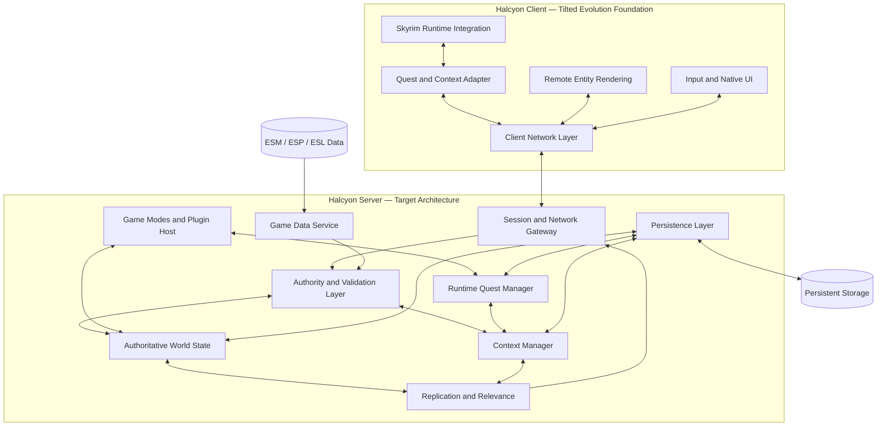
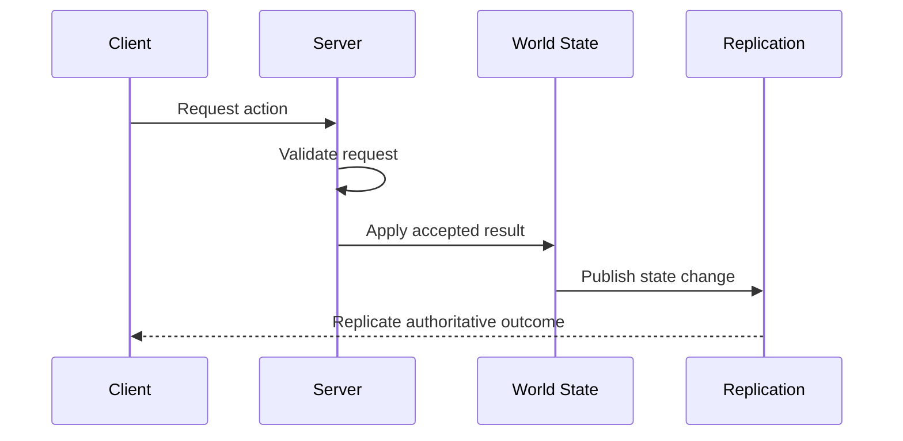
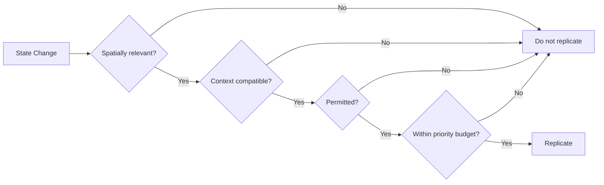

# HTDS-006 — Architecture Principles

| Field | Value |
| --- | --- |
| Document ID | HTDS-006 |
| Title | Architecture Principles |
| Version | 0.1.0 |
| Status | Draft Skeleton |
| Maturity | Conceptual / Pre-Implementation |
| Audience | Engine developers, network developers, gameplay developers, plugin authors, and contributors |

## 1. Purpose

This document defines the initial architectural principles intended to guide Halcyon's development.

Most systems described here do not exist yet in their final form. The current repository is still primarily based on Tilted Evolution, and several principles in this document describe a target architecture rather than current behavior.

This document is therefore intentionally marked as a **Draft Skeleton**.

Its purpose is to:

- establish a shared architectural direction;
- identify the responsibilities expected from future subsystems;
- expose assumptions before implementation begins;
- provide a framework for future RFCs and ADRs;
- prevent short-term implementation decisions from silently becoming permanent architecture.

The details in this document MAY change substantially as prototypes, source-code analysis, performance testing, Skyrim engine limitations, and compatibility requirements reveal better approaches.

The principles themselves SHOULD remain stable unless an accepted ADR replaces them.

## 2. Current Implementation Reality

Halcyon currently inherits most of its architecture from Tilted Evolution.

The existing implementation already provides:

- a functional Skyrim multiplayer client;
- a dedicated server;
- networking and serialization;
- remote player and actor synchronization;
- parties and social features;
- inventory, equipment, combat, spells, and actor-value synchronization;
- Linux and Proton client adaptations;
- a native ImGui interface;
- compatibility with the Skyrim Together Reborn protocol.

The following planned systems are not yet implemented as described by this document:

- generalized Context ownership;
- Context-aware narrative replication;
- authoritative server-side world state;
- Context-scoped persistent change forms;
- server-created runtime quests;
- TypeScript game modes;
- comprehensive server-side plugin-data parsing;
- narrative instances;
- authoritative quest-state reconciliation;
- a stable Halcyon plugin SDK.

The project MUST distinguish between:

1. current implementation;
2. transitional implementation;
3. target architecture.

Documentation and code comments SHOULD avoid presenting planned behavior as if it already exists.

## 3. Architectural Overview

The current architectural hypothesis is shown below.



This diagram is an architectural sketch, not a final module map.

Future implementation MAY combine, split, rename, or relocate these components.

## 4. Principle 1 — Server First

The server SHOULD be treated as the preferred location for authoritative multiplayer decisions.

Clients should request actions rather than declare final state whenever practical.

Conceptual flow:



Examples of future server-authoritative decisions include:

- player damage;
- actor death;
- Context membership;
- reward distribution;
- runtime quest completion;
- bounty claims;
- persistent object changes;
- ownership changes;
- PvP rule enforcement.

### Transitional reality

Some existing Tilted Evolution systems rely on client ownership and client-originated state.

These systems MAY remain temporarily.

The migration path SHOULD be incremental:

```text
Client authoritative
        ↓
Server records and broadcasts
        ↓
Server validates client state
        ↓
Server computes authoritative state
```

No subsystem should be rewritten solely to satisfy architectural purity if the rewrite would destroy working functionality without delivering a testable improvement.

## 5. Principle 2 — Context-Oriented Multiplayer

A **Context** is the planned logical unit used to scope state, visibility, ownership, and participation.

Possible Context types include:

```cpp
enum class ContextType
{
    Global,
    Personal,
    Party,
    Narrative,
    Dungeon,
    RuntimeQuest,
    PublicEvent,
    ServerDefined
};
```

This enumeration is illustrative and not yet an API commitment.

A Context may own or select:

- quest state;
- actor state;
- object state;
- branch decisions;
- runtime objectives;
- participants;
- replication policy;
- persistence policy;
- lifecycle rules.

Contexts are intended to replace scattered special cases with a common abstraction.

### Example

```text
Global Context
├── public players
├── shared weather
└── public PvP

Party Context 42
├── quest MQ105 stage 40
├── quest actors
├── puzzle state
└── dungeon changes

Personal Context 91
├── solo quest state
├── personal branch decisions
└── personal scripted objects
```

The final Context model is still an open design problem.

Questions to resolve include:

- Can entities belong to multiple Contexts?
- Can Contexts inherit state?
- Can Contexts be nested?
- How are conflicts resolved?
- How is state merged when joining or leaving a party?
- Which state is temporary?
- Which state is committed permanently?

These questions require dedicated RFCs.

## 6. Principle 3 — Shared World, Independent Stories

Players SHOULD share the physical multiplayer world whenever safe.

Different narrative progression SHOULD NOT automatically hide players from one another.

A player may:

- see another player;
- communicate;
- trade;
- cooperate;
- attack them when PvP is enabled;

while remaining unable to modify unrelated quest state.

The intended replication rule is conceptually:

```cpp
bool ShouldReplicate(
    const Entity& entity,
    const PlayerSession& recipient)
{
    return IsSpatiallyRelevant(entity, recipient) &&
           IsContextuallyRelevant(entity, recipient);
}
```

This example is illustrative.

In some cases, incompatible story states may require complete phasing or separate cell instances.

The system SHOULD prefer the least isolating solution that remains safe.

## 7. Principle 4 — Progressive Authority

Halcyon MUST NOT require a single disruptive rewrite before becoming useful.

Authority should move to the server subsystem by subsystem.

Each subsystem SHOULD declare its authority level.

Suggested classification:

```cpp
enum class AuthorityMode
{
    LegacyClient,
    ClientOwnedServerRecorded,
    ServerValidated,
    ServerAuthoritative,
    Cosmetic
};
```

Examples:

| Subsystem | Initial mode | Target mode |
| --- | --- | --- |
| Local animation | Cosmetic/client | Cosmetic/client |
| Runtime quest reward | Not implemented | Server authoritative |
| Party membership | Existing server logic | Server authoritative |
| Player movement | Client-owned | Server validated where feasible |
| Quest stage | Client-originated | Context-aware server coordinated |
| Persistent actor death | Client-originated | Context-scoped server authoritative |

The precise classification will be documented in subsystem specifications.

## 8. Principle 5 — Explicit Ownership

Every replicated state change SHOULD have an identifiable owner or authority.

Ownership categories may include:

- server;
- player session;
- party leader;
- Context;
- runtime quest;
- script;
- temporary simulation owner.

Ownership MUST NOT be inferred only from whichever client sent a packet first.

The server should be able to answer:

- who may update this entity;
- which Context owns this state;
- who may observe it;
- whether the change is persistent;
- what revision supersedes older state.

An illustrative entity header may look like:

```cpp
struct EntityAuthority
{
    EntityId entityId;
    ContextId contextId;
    AuthorityMode mode;
    std::optional<PlayerId> clientOwner;
    std::uint64_t revision;
};
```

This is not yet a final API.

## 9. Principle 6 — Spatial and Contextual Relevance

Replication SHOULD be filtered through multiple independent concerns.

At minimum:

1. spatial relevance;
2. Context relevance;
3. permission relevance;
4. subscription relevance;
5. priority and bandwidth limits.

Conceptual pipeline:



The first prototype may only add Context filtering to the existing replication path.

More advanced interest management can be introduced later.

## 10. Principle 7 — Base World Plus Scoped Deltas

Halcyon SHOULD avoid copying the entire Skyrim world for every player, party, or instance.

The preferred persistence model is:

```text
Base game and mod data
        +
Context-scoped changes
        =
Effective world view
```

Examples of scoped changes:

- actor dead or alive;
- reference enabled or disabled;
- door locked or unlocked;
- container contents;
- object position;
- quest stage;
- objective completion;
- branch decision;
- runtime quest progress.

Illustrative structure:

```cpp
struct ScopedChangeForm
{
    ContextId contextId;
    FormId referenceId;
    Revision revision;
    ChangeMask changedFields;
    SerializedState payload;
};
```

This design is inspired by change-form concepts but is not yet tied to Skyrim's save format or SkyMP's implementation.

## 11. Principle 8 — Game Data Awareness

A server that validates Skyrim actions should understand enough game data to make meaningful decisions.

Halcyon SHOULD eventually load metadata from:

- ESM files;
- ESP files;
- ESL files;
- server-required content manifests.

Potential uses include:

- FormID validation;
- record-type identification;
- cell and worldspace lookup;
- actor and reference metadata;
- quest relationships;
- faction relationships;
- container definitions;
- leveled data;
- compatibility checks.

The server does not need to reproduce the entire Creation Engine.

Only data required by authoritative systems should be loaded.

SkyMP's `libespm` or similar components may be studied, but any reuse MUST follow applicable licenses.

## 12. Principle 9 — Engine Core and Gameplay Separation

The native core SHOULD provide infrastructure.

Game modes SHOULD provide server-specific gameplay.

### Native core responsibilities

- networking;
- protocol handling;
- sessions;
- world state;
- Contexts;
- replication;
- persistence primitives;
- validation;
- game-data access;
- security boundaries;
- plugin hosting.

### Game-mode responsibilities

- bounty rules;
- world events;
- runtime quests;
- faction behavior;
- economy;
- guild systems;
- server-specific commands;
- seasonal content.

This division is conceptual and will evolve.

High-frequency or security-critical logic should remain native.

Content-oriented logic may later be exposed through TypeScript or another suitable runtime.

## 13. Principle 10 — Runtime Content Is Server-Owned

Runtime quests and public events MUST be created, tracked, and completed by the server.

A client may display:

- title;
- description;
- objectives;
- progress;
- map markers;
- timer;
- participants;
- reward preview.

The client MUST NOT decide completion or rewards.

Conceptual model:

```cpp
struct RuntimeQuest
{
    RuntimeQuestId id;
    ContextId contextId;
    RuntimeQuestType type;
    RuntimeQuestStatus status;
    std::vector<RuntimeObjective> objectives;
    std::vector<RuntimeReward> rewards;
    TimePoint expiresAt;
};
```

The first implementation may use native C++ only.

A scripting API can be added after lifecycle and security rules are stable.

## 14. Principle 11 — Controlled Client Commands

The server will sometimes need Skyrim clients to execute local engine operations.

Examples:

- display an objective;
- set a quest stage;
- enable a reference;
- apply a spell;
- play an animation;
- show a notification;
- add a map marker.

The server SHOULD send typed commands rather than arbitrary executable code.

Illustrative command set:

```cpp
enum class ClientCommandType
{
    ShowNotification,
    SetQuestStage,
    SetObjectiveState,
    EnableReference,
    DisableReference,
    ApplySpell,
    PlayAnimation,
    AddMapMarker,
    RemoveMapMarker
};
```

Commands MUST be:

- versioned;
- validated;
- logged where appropriate;
- constrained to known operations;
- safe to reject when unsupported.

## 15. Principle 12 — Compatibility Is Explicit

Halcyon MUST distinguish several kinds of compatibility:

- network protocol compatibility;
- build compatibility;
- Skyrim runtime compatibility;
- mod compatibility;
- save compatibility;
- plugin API compatibility;
- server-data compatibility.

A compatible protocol does not guarantee a compatible modlist.

A compatible modlist does not guarantee multiplayer-safe scripts.

Breaking changes SHOULD be announced through versioned capabilities rather than hidden behind one generic version number.

## 16. Principle 13 — Linux and Proton Are Architectural Constraints

Linux support should influence architecture before implementation.

The project SHOULD avoid making Windows-only assumptions in:

- file paths;
- process discovery;
- launcher integration;
- filesystem case handling;
- socket behavior;
- build tooling;
- logging;
- packaging.

For the client, Wine and Proton compatibility SHOULD be considered when choosing:

- UI frameworks;
- subprocess architecture;
- DLL-loading strategies;
- input paths;
- graphics hooks;
- IPC;
- embedded runtimes.

The current native ImGui approach is preferred over restoring a mandatory CEF dependency.

## 17. Principle 14 — Incremental Migration

The existing source tree MUST remain buildable during architecture migration.

Code SHOULD move only when there is a real module to receive it.

Empty directory rearrangements SHOULD NOT be treated as architectural progress.

The expected migration pattern is:

1. document current behavior;
2. define target behavior;
3. create an interface boundary;
4. implement a parallel or adapted path;
5. add tests and diagnostics;
6. migrate callers;
7. remove the obsolete path.

Compatibility adapters MAY exist temporarily.

## 18. Principle 15 — Observability by Design

Every authoritative subsystem SHOULD expose enough information to diagnose divergence.

Useful diagnostic data may include:

- Context ID;
- entity ID;
- FormID;
- authority mode;
- owner;
- revision;
- sender;
- recipients;
- validation result;
- persistence result;
- protocol capability;
- mod manifest.

Logs SHOULD avoid exposing secrets while remaining useful to server operators.

Structured logs and metrics are preferred for server systems.

## 19. Principle 16 — Failure Must Be Contained

A failure in one Context SHOULD NOT corrupt unrelated Contexts.

A game-mode plugin SHOULD NOT be able to crash the entire server through ordinary script errors.

A persistence failure SHOULD be detectable before acknowledging irreversible actions when possible.

Unsupported client commands SHOULD fail gracefully.

Invalid packets MUST be rejected without mutating authoritative state.

The final isolation strategy is not yet defined and may include:

- exception boundaries;
- plugin sandboxes;
- transactional persistence;
- actor-style message queues;
- worker processes;
- watchdogs.

## 20. Principle 17 — Security Boundaries Before Convenience

The server MUST NOT trust:

- client-reported rewards;
- client-reported quest completion;
- arbitrary inventory changes;
- unrestricted client commands;
- unvalidated FormIDs;
- stale revisions;
- ownership claims without verification.

Not every system can be authoritative immediately, but new server-driven systems SHOULD be designed with validation from the beginning.

Halcyon is not intended to provide kernel-level anti-cheat.

Its security goal is to make the server authoritative enough that ordinary client manipulation cannot directly grant persistent server-side benefits.

## 21. Principle 18 — Specification and Implementation Must Remain Distinguishable

Every major HTDS architecture document SHOULD include an implementation-status section.

Suggested status fields:

```text
Conceptual
Prototype
Partially Implemented
Implemented
Validated
```

This document is currently:

```text
Architecture status: Conceptual
Implementation status: Mostly not implemented
Validation status: Requires prototypes and source analysis
```

Future documents MUST NOT claim completion merely because the intended architecture has been written.

## 22. Initial Module Hypothesis

The following module structure is a working hypothesis.

```text
halcyon/
├── server/
│   ├── world/
│   ├── contexts/
│   ├── authority/
│   ├── replication/
│   ├── persistence/
│   ├── game-data/
│   ├── runtime-quests/
│   ├── plugins/
│   └── administration/
├── client/
│   ├── context-adapter/
│   ├── quest-adapter/
│   ├── runtime-quest-ui/
│   ├── integrations/
│   └── diagnostics/
├── sdk/
│   ├── cpp/
│   ├── protocol/
│   └── scripting/
└── tools/
    ├── data-inspector/
    ├── migration/
    ├── manifest/
    └── admin-cli/
```

This layout is not final.

Existing code will remain under the current Tilted Evolution directories until migration provides real value.

## 23. Initial Prototype Targets

The first architecture prototype SHOULD prove Context-aware replication without requiring the complete target system.

Suggested test scenario:

1. two solo players enter the same cell;
2. both remain visible to one another;
3. both share global NPCs;
4. each receives a separate Context-scoped state for one quest-critical actor;
5. one player kills that actor;
6. the other player's actor remains alive;
7. PvP between the two players still functions;
8. reconnecting restores each player's effective state.

A second prototype SHOULD implement one server-created runtime event:

1. the server creates an event;
2. eligible players receive the event;
3. progress is tracked server-side;
4. completion is validated;
5. rewards are persisted;
6. clients only render state and submit actions.

These prototypes will reveal whether the current Context hypothesis is viable.

## 24. Open Architecture Questions

The following questions are intentionally unresolved:

- What is the minimal Context data model?
- Are Contexts hierarchical?
- Can a player be active in several Contexts simultaneously?
- How are party and personal quest states reconciled?
- Which quest state can safely be fast-forwarded?
- How should incompatible branches be detected?
- How are aliases, scripts, and scenes reconciled?
- Can exterior cells support entity-level phasing reliably?
- When is full cell instancing required?
- What database model best supports scoped change forms?
- Which SkyMP components can be reused legally and technically?
- Is TypeScript the correct long-term game-mode runtime?
- How much Papyrus can realistically execute server-side?
- Which combat systems can become server authoritative without making gameplay feel unresponsive?
- How is a mod manifest negotiated and validated?
- Which protocol changes can coexist with vanilla STR clients?

These questions should produce research documents, RFCs, and ADRs rather than being answered informally in implementation code.

## 25. Change Policy

This document is expected to change.

Changes are encouraged when supported by:

- prototype results;
- profiling;
- engine limitations;
- protocol analysis;
- mod compatibility findings;
- security review;
- contributor feedback;
- operational experience.

Major reversals SHOULD create an ADR explaining:

- what changed;
- why the previous assumption failed;
- what consequences follow;
- how existing code and data will migrate.

## 26. Closing Statement

HTDS-006 is not a claim that Halcyon already has a modern authoritative architecture.

It is a documented hypothesis for how the project may evolve from its current Tilted Evolution foundation.

The architecture will be validated through small prototypes, explicit migration boundaries, and continuous comparison between specification and implementation.

The project should remain ambitious about its destination and honest about its current state.
