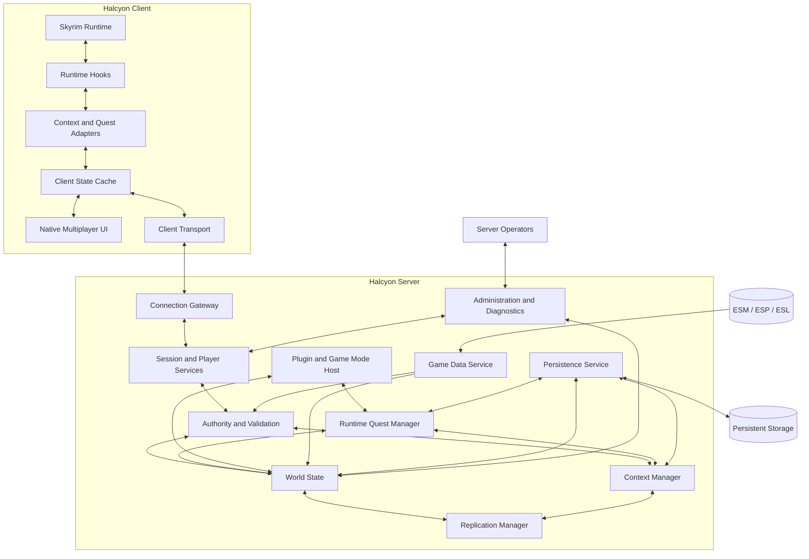
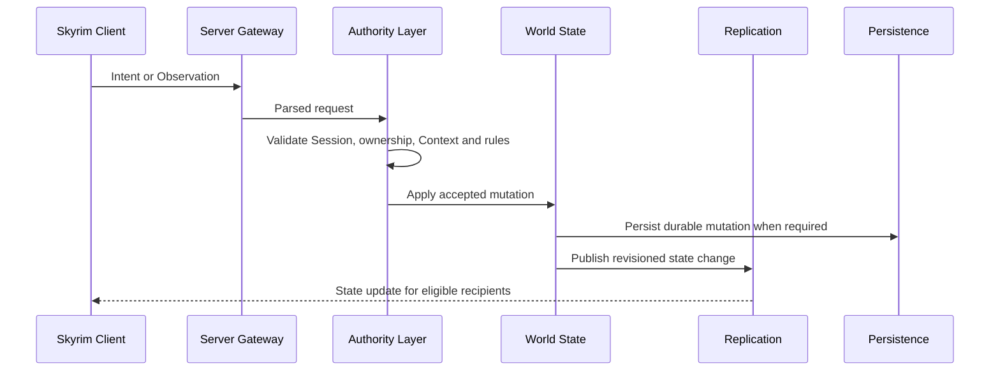

# HTDS-100 — System Overview

| Field | Value |
| --- | --- |
| Document ID | HTDS-100 |
| Title | System Overview |
| Version | 0.1.0 |
| Status | Draft Skeleton |
| Maturity | Conceptual / Pre-Implementation |

## 1. Purpose

This document provides the initial top-level view of Halcyon's target architecture.

It describes intended subsystem boundaries and data flow without committing to final class names, directory layouts, process boundaries, databases, or scripting runtimes.

The implementation is expected to evolve gradually from the current Tilted Evolution architecture.

## 2. Current Foundation

Halcyon currently inherits:

- the Skyrim runtime integration;
- the dedicated server;
- the existing network protocol;
- serialization infrastructure;
- player and actor synchronization;
- parties;
- combat and actor-value synchronization;
- inventory, equipment, spell, and world interaction systems;
- the Linux/Proton launcher and client adaptations;
- the native ImGui interface.

These systems remain the working product foundation.

## 3. Target System Shape



This is a conceptual diagram.

Subsystems may be merged or separated during implementation.

## 4. Architectural Layers

### 4.1 Skyrim Integration Layer

Runs in the client and interacts with the local game.

Responsibilities may include:

- observing engine events;
- applying accepted remote state;
- rendering remote Entities;
- reading supported quest state;
- executing typed client commands;
- presenting multiplayer UI;
- handling Proton-specific integration.

### 4.2 Transport and Protocol Layer

Provides communication between client and server.

Responsibilities include:

- connection establishment;
- authentication;
- capability negotiation;
- serialization;
- reliable and unreliable delivery;
- protocol versioning;
- message validation;
- disconnect handling.

### 4.3 Session Layer

Represents live connected clients.

Responsibilities may include:

- mapping Sessions to Players;
- connection lifecycle;
- rate limits;
- capability tracking;
- permission checks;
- Context membership references.

### 4.4 Authority Layer

Determines whether an Intent or Observation is accepted.

Responsibilities may include:

- ownership validation;
- revision checking;
- game-rule validation;
- PvP validation;
- Runtime Quest validation;
- persistent reward validation;
- compatibility checks.

### 4.5 Context Layer

Defines the state scopes in which Players and Entities participate.

Responsibilities may include:

- Context creation;
- membership;
- transitions;
- inheritance or composition if adopted;
- conflict detection;
- lifecycle;
- isolation.

### 4.6 World-State Layer

Stores the authoritative multiplayer representation of relevant Skyrim state.

Responsibilities may include:

- Entities;
- actor values;
- transforms;
- ownership;
- object state;
- scoped changes;
- revisions;
- runtime-created objects.

### 4.7 Replication Layer

Determines what each Session receives.

Inputs may include:

- spatial relevance;
- Context relevance;
- permissions;
- subscriptions;
- update priority;
- bandwidth budget;
- client capabilities.

### 4.8 Persistence Layer

Stores durable state and restores it after restart or reconnect.

Potential persisted data includes:

- Players and Characters;
- Contexts;
- scoped Change Forms;
- Parties;
- Runtime Quests;
- bounties;
- rewards;
- audit records.

### 4.9 Extension Layer

Hosts server-specific gameplay outside the core.

Potential systems include:

- public events;
- economy;
- factions;
- guilds;
- bounty rules;
- seasonal content;
- custom commands.

### 4.10 Administration Layer

Provides operational visibility and control.

Potential features include:

- logs;
- metrics;
- health checks;
- moderation;
- permissions;
- audit data;
- remote administration.

## 5. Primary Data Flow

The preferred authoritative flow is:



Legacy flows may bypass parts of this pipeline during migration.

## 6. Core Invariants

The target architecture should preserve these invariants:

1. Durable rewards are not decided solely by clients.
2. Unrelated Contexts do not mutate one another.
3. Stale revisions do not overwrite newer authoritative state.
4. A Session disconnect does not destroy persistent Player state.
5. Replication recipients are selected deliberately.
6. Unsupported client capabilities fail safely.
7. Persistent mutations are auditable.
8. Base game data is not duplicated unnecessarily for every Context.
9. Architecture documentation distinguishes plans from implementation.

## 7. Deployment Hypothesis

The initial production shape is expected to remain simple:

```text
One Halcyon server process
One persistence backend
Several connected Skyrim clients
Optional game-mode scripts
```

The architecture should not unnecessarily prevent later separation into:

- gateway services;
- world workers;
- persistence services;
- script workers;
- administrative services.

Distributed deployment is not an initial requirement.

## 8. Compatibility Strategy

Halcyon should preserve existing protocol compatibility where practical.

New behavior may be introduced through:

- capability negotiation;
- optional messages;
- protocol extensions;
- server feature flags;
- Halcyon-only server modes.

A vanilla STR-compatible mode may remain available while more authoritative Halcyon behavior requires a Halcyon client.

## 9. Initial Migration Strategy

The first architecture work should avoid broad rewrites.

Suggested order:

1. document current server and replication behavior;
2. introduce Context identifiers without changing all gameplay;
3. carry Context metadata through selected messages;
4. add Context filtering to one replication path;
5. implement one scoped persistent state type;
6. validate reconnect behavior;
7. implement one Runtime Quest prototype;
8. expand authority incrementally.

## 10. Open Questions

- How much of the existing server can be evolved without replacement?
- Should Context management be part of the existing World or a separate service?
- Which state needs strict transactions?
- Which messages require capability negotiation?
- How should Skyrim plugin identities be normalized?
- Should high-level game modes run in-process or in a worker?
- Which systems need fixed-tick processing?
- Which state should use events versus direct snapshots?
- Can vanilla STR clients coexist safely with Context-aware clients?

## 11. Implementation Status

```text
Architecture status: Conceptual
Prototype status: Not started
Production implementation: Existing Tilted Evolution architecture
Validation status: Requires code mapping and focused prototypes
```
