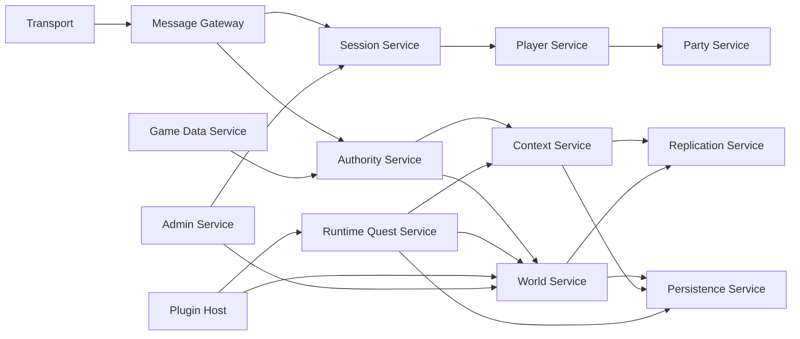

# HTDS-110 — Server Architecture

| Field | Value |
| --- | --- |
| Document ID | HTDS-110 |
| Title | Server Architecture |
| Version | 0.1.0 |
| Status | Draft Skeleton |
| Maturity | Conceptual / Pre-Implementation |

## 1. Purpose

This document outlines the target responsibilities and internal boundaries of the Halcyon dedicated server.

It does not prescribe final C++ types or process boundaries.

## 2. Server Role

The Halcyon server is intended to become the authoritative coordinator of multiplayer state.

It should eventually own or validate:

- Sessions and persistent Player identity;
- Party membership;
- Context membership;
- Entity ownership;
- persistent World State;
- Runtime Quests;
- public events;
- bounty claims;
- rewards;
- PvP rules;
- durable changes;
- compatibility policy.

## 3. Current Reality

The current server is inherited from Tilted Evolution.

Several gameplay systems still depend on client-originated state and cell or actor ownership.

The target architecture will be introduced incrementally around existing working services.

## 4. Proposed Internal Services



## 5. Session Service

The Session Service should manage live connections.

Potential state:

```cpp
struct SessionDescriptor
{
    SessionId sessionId;
    PlayerId playerId;
    ProtocolVersion protocol;
    CapabilitySet capabilities;
    PermissionSet permissions;
    ConnectionState state;
};
```

This structure is illustrative.

Responsibilities may include:

- authentication;
- reconnect tokens;
- capability negotiation;
- rate limiting;
- disconnect cleanup;
- Session-to-Player mapping.

## 6. Player Service

The Player Service should represent durable identity independent of one connection.

Potential responsibilities:

- Player profile;
- active Character;
- permissions;
- progression metadata;
- personal Context;
- current Party;
- reconnect restoration.

## 7. Party Service

Party membership should remain server-owned.

The Party Service may manage:

- creation;
- invitations;
- leadership;
- membership;
- party permissions;
- Party Context association;
- transition policies;
- lifecycle after all members disconnect.

Party leadership must not automatically overwrite member Personal state.

## 8. Authority Service

The Authority Service is the intended validation boundary for state-changing requests.

Conceptual interface:

```cpp
class AuthorityService
{
public:
    ValidationResult Validate(
        const SessionDescriptor& session,
        const ClientIntent& intent,
        const AuthoritySnapshot& currentState) const;
};
```

Validation may check:

- authenticated identity;
- ownership;
- Context compatibility;
- current revision;
- distance;
- cooldown;
- inventory;
- game rules;
- target existence;
- client capability.

The final architecture may distribute validation across domain services instead of one central class.

## 9. Context Service

The Context Service should manage:

- Context creation;
- type and policy;
- membership;
- participant roles;
- active state;
- conflict metadata;
- transitions;
- expiry;
- persistence identity.

Conceptual model:

```cpp
struct ContextDescriptor
{
    ContextId id;
    ContextType type;
    ContextState state;
    ContextPolicy policy;
    Revision revision;
};
```

The Context Service should not necessarily store all Entity data itself.

## 10. World Service

The World Service should expose the authoritative multiplayer representation of Entities and references.

Possible responsibilities:

- Entity lookup;
- transform and actor state;
- ownership;
- scoped state resolution;
- revisions;
- mutation publication;
- spawn and despawn;
- base-data lookup integration.

The World Service should not attempt to reproduce all Skyrim simulation.

## 11. Game Data Service

The Game Data Service should load multiplayer-relevant metadata from the configured plugin set.

Potential interfaces:

```cpp
class GameDataService
{
public:
    const RecordView* FindRecord(NormalizedFormId id) const;
    const CellView* FindCell(NormalizedFormId id) const;
    const QuestView* FindQuest(NormalizedFormId id) const;
};
```

The final parser and record coverage remain open questions.

## 12. Replication Service

The Replication Service should consume authoritative changes and calculate recipients.

Conceptual decision:

```cpp
ReplicationDecision Evaluate(
    const ReplicationEvent& event,
    const SessionDescriptor& recipient);
```

The decision may consider:

- cell and distance;
- Context membership;
- permissions;
- subscriptions;
- capabilities;
- priority;
- bandwidth.

## 13. Runtime Quest Service

The Runtime Quest Service should own the lifecycle of server-created activities.

Responsibilities may include:

- templates;
- creation;
- enrollment;
- objectives;
- contribution;
- timers;
- completion;
- expiry;
- rewards;
- persistence;
- client presentation state.

## 14. Plugin Host

The Plugin Host is expected to expose safe, versioned APIs to game modes.

The first implementation may be absent or native-only.

Future requirements may include:

- script isolation;
- API versioning;
- resource limits;
- error boundaries;
- event subscriptions;
- hot reload for development;
- deterministic shutdown.

## 15. Persistence Service

The Persistence Service should provide domain-oriented operations rather than exposing raw SQL across the codebase.

Potential guarantees:

- transactional durable changes;
- schema versioning;
- idempotent writes;
- recovery;
- migration;
- audit integration.

The first backend may use SQLite for development.

Production deployments may use PostgreSQL or another reviewed backend.

No backend is mandated by this skeleton.

## 16. Event Flow

The server may use domain events to decouple services.

Example:

```cpp
struct ActorKilledEvent
{
    EntityId actor;
    ContextId context;
    std::optional<PlayerId> killer;
    Revision revision;
};
```

Events should represent accepted outcomes, not unvalidated client claims.

The event bus design remains open.

## 17. Threading and Concurrency

No final concurrency model has been selected.

Candidates include:

- one authoritative simulation thread;
- domain-specific workers;
- actor-style mailboxes;
- task-based execution;
- lock-protected shared services.

Correctness and diagnosability should be preferred over premature parallelism.

State mutation should have clear ordering.

## 18. Failure Boundaries

The server should contain failures where possible.

Potential boundaries:

- malformed client messages;
- plugin errors;
- persistence failures;
- game-data parser failures;
- individual Context failures;
- administrator command errors.

An ordinary plugin exception should not terminate the server.

## 19. Initial Server Prototype

The first server prototype should introduce:

- a minimal `ContextId`;
- membership for two Players;
- one Context-scoped actor state;
- Context-aware recipient filtering;
- revision tracking;
- reconnect restoration.

This prototype should avoid implementing a complete quest system.

## 20. Implementation Status

```text
Architecture status: Conceptual
Current server: Tilted Evolution implementation
Context Service: Not implemented
Authoritative World Service: Not implemented as specified
Runtime Quest Service: Not implemented
Plugin Host: Not implemented
Persistence redesign: Not implemented
```
