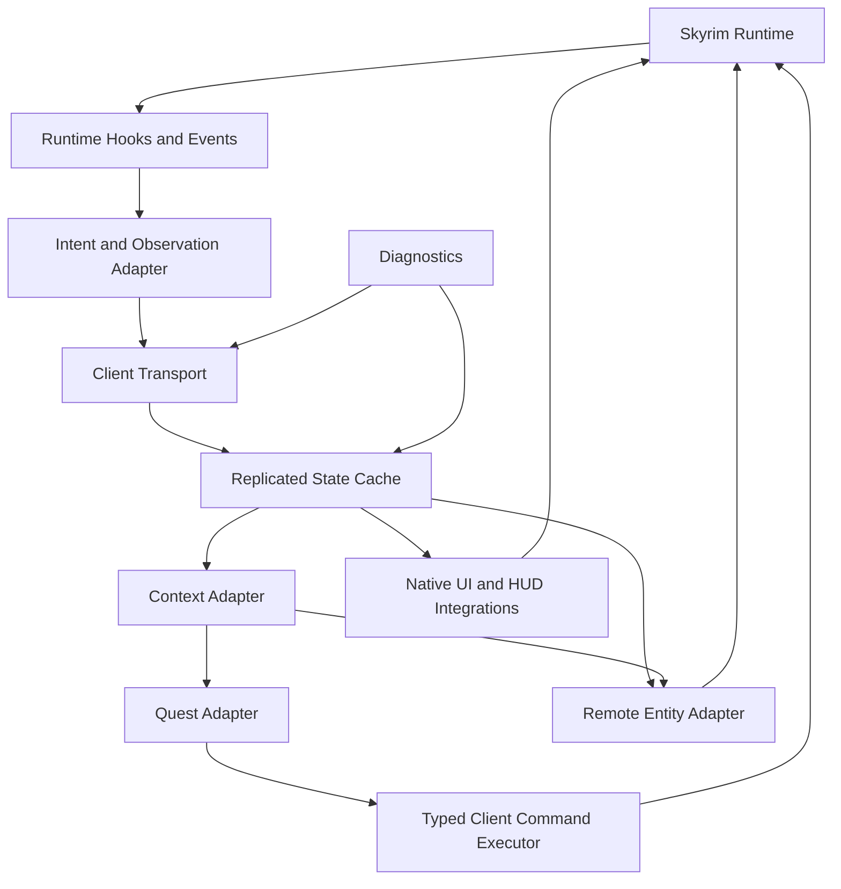

# HTDS-120 — Client Architecture

| Field | Value |
| --- | --- |
| Document ID | HTDS-120 |
| Title | Client Architecture |
| Version | 0.1.0 |
| Status | Draft Skeleton |
| Maturity | Conceptual / Partially Based on Existing Implementation |

## 1. Purpose

This document outlines the intended role of the Halcyon client.

Unlike much of the target server architecture, a substantial client foundation already exists through Tilted Evolution and the Linux/Proton fork.

## 2. Client Role

The client integrates Halcyon with the local Skyrim runtime.

It is responsible for:

- observing local game events;
- transmitting Intents and Observations;
- applying accepted server state;
- rendering remote players and actors;
- presenting multiplayer UI;
- adapting Context-specific state to the local game;
- preserving Proton compatibility.

The target client should increasingly act as an adapter and renderer rather than the final authority for persistent multiplayer outcomes.

## 3. Existing Client Foundation

The current client already includes:

- game hooks;
- launcher and payload injection;
- remote player and actor handling;
- network transport;
- service-based synchronization;
- native ImGui UI;
- party UI;
- chat;
- public server browser;
- native notifications;
- persistent party HUD;
- optional TrueHUD integration;
- Proton-specific input and process handling.

These systems should be evolved rather than replaced without reason.

## 4. Proposed Client Subsystems



## 5. Runtime Hooks

Runtime Hooks observe local engine behavior.

Examples:

- actor hits;
- actor values;
- death;
- movement;
- equipment;
- spells;
- activation;
- cell changes;
- quest stages;
- animation events.

Hooks should produce structured internal events.

Hooks are implementation details and should not automatically become public SDK APIs.

## 6. Intent and Observation Adapter

The adapter should classify client-originated information.

An **Intent** describes an attempted action.

An **Observation** describes local engine behavior.

An accepted **Outcome** comes from the server.

The client should avoid using one message type for all three meanings.

## 7. Replicated State Cache

The client may maintain a cache of server state for:

- remote Entities;
- revisions;
- Context membership;
- Runtime Quests;
- capabilities;
- party state;
- authoritative actor values.

The cache should support replacement by full snapshots and incremental delta updates.

## 8. Context Adapter

The Context Adapter is planned to convert server Context state into an effective local view.

Potential responsibilities:

- activate and deactivate Context state;
- phase Entities;
- apply scoped Reference state;
- select quest state;
- restore state after transition;
- reject stale updates;
- coordinate with the Quest Adapter.

This is one of the highest-risk future client systems.

## 9. Quest Adapter

The Quest Adapter should provide controlled operations over supported Skyrim quest behavior.

Potential operations include:

- read quest stage;
- apply stage;
- display or complete objectives;
- read supported aliases;
- apply supported actor and Reference state;
- report local quest events;
- display Runtime Quest information.

The Quest Adapter must not assume every vanilla or modded quest is safely reversible or mergeable.

## 10. Remote Entity Adapter

The Remote Entity Adapter should render server-selected Entities inside Skyrim.

Responsibilities may include:

- player actors;
- NPCs and creatures;
- transforms;
- animation state;
- equipment;
- actor values;
- spawn and despawn;
- Context phasing;
- ownership transitions.

Existing Tilted Evolution systems are expected to provide much of this foundation.

## 11. Typed Client Command Executor

The server may need the client to invoke approved local engine operations.

Commands should be typed and constrained.

Examples:

- show notification;
- apply supported quest stage;
- enable or disable a Reference;
- apply a spell;
- play an animation;
- add or remove a map marker.

The client should reject unknown or unsupported commands safely.

## 12. Native UI

The Linux path should continue using native ImGui and supported game integrations rather than mandatory CEF.

UI domains may include:

- connection;
- server browser;
- parties;
- chat;
- network diagnostics;
- Runtime Quests;
- public events;
- bounty contracts;
- Context transition warnings;
- mod mismatch diagnostics.

TrueHUD may remain an optional integration rather than a hard dependency.

## 13. Linux and Proton Requirements

The client architecture should account for:

- Wine paths;
- process injection;
- high-ASLR game images;
- focus and raw input;
- Steam prefixes;
- launcher behavior;
- DLL loading;
- filesystem case differences;
- reliable logging without a visible console.

The project should avoid adding an embedded Chromium dependency to the required Linux path.

## 14. Client Trust Boundary

The client should be considered untrusted for persistent multiplayer benefits.

It may remain responsible for latency-sensitive local presentation and report engine observations.

The server should validate or own:

- rewards;
- Runtime Quest completion;
- bounty completion;
- persistent inventory grants;
- server economy;
- Context transitions;
- durable world mutations.

## 15. Local Save Interaction

The local save remains important to Skyrim.

However, reconnecting with an older save should not overwrite newer server state.

Potential future approaches include:

- server reconciliation after load;
- Context-specific reapplication;
- imported-state comparison;
- save metadata;
- warnings for unsupported divergence.

The final save policy requires dedicated research.

## 16. Compatibility Modes

The client may eventually support:

- vanilla STR-compatible mode;
- Halcyon capability mode;
- authoritative server mode;
- development diagnostics mode.

Capabilities should be negotiated explicitly.

## 17. Initial Client Prototype

The first Context prototype should:

1. receive one Context identifier;
2. receive one Context-scoped actor state;
3. hide or preserve the correct actor view;
4. keep another player visible;
5. continue PvP replication;
6. restore state after reconnect.

The prototype should not begin by attempting full quest replication.

## 18. Implementation Status

```text
Native client foundation: Implemented
Linux/Proton path: Implemented experimentally
Native UI: Implemented
TrueHUD integration: Implemented optionally
Context Adapter: Not implemented
Quest Adapter: Not implemented as specified
Typed command set: Not implemented as specified
Authoritative reconciliation: Not implemented
```
