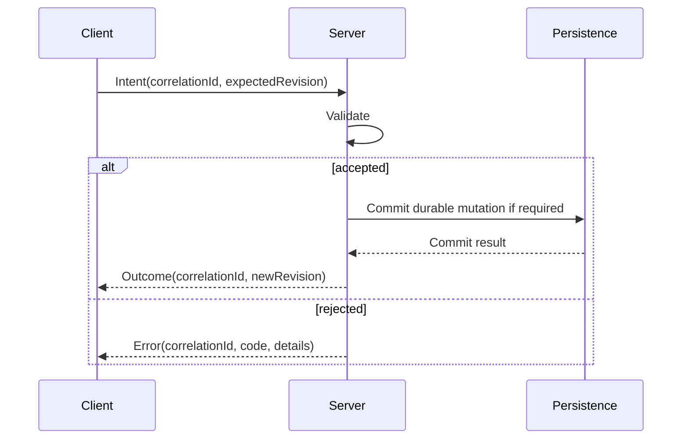

# HTDS-130 — Network Architecture

| Field | Value |
| --- | --- |
| Document ID | HTDS-130 |
| Title | Network Architecture |
| Version | 0.1.0 |
| Status | Draft Skeleton |
| Maturity | Conceptual / Existing Protocol Foundation |

## 1. Purpose

This document outlines the intended evolution of Halcyon's client-server protocol.

Halcyon inherits a working protocol from Tilted Evolution.

The target architecture should extend that protocol deliberately rather than replacing it without evidence.

## 2. Existing Foundation

The current protocol supports major Skyrim Together functionality, including:

- connection and authentication;
- player state;
- actor synchronization;
- parties;
- chat;
- inventory and equipment;
- actor values;
- spells;
- world interactions;
- server settings.

The exact current message inventory must be documented through code analysis.

## 3. Protocol Goals

The protocol should support:

- explicit build and protocol identity;
- capability negotiation;
- Context metadata;
- revisioned state;
- authoritative Intents and Outcomes;
- Runtime Quests;
- reconnect recovery;
- structured errors;
- mod manifests;
- backward-compatible optional features where practical.

## 4. Message Semantics

Halcyon should distinguish:

- **Intent** — a requested player action;
- **Observation** — a local engine report;
- **Command** — a typed trusted instruction;
- **Notification** — an accepted event announcement;
- **Snapshot** — a complete state representation;
- **Delta** — changes since known state;
- **Acknowledgement** — receipt or durable acceptance;
- **Error** — structured rejection or failure.

Naming should reveal semantics.

## 5. Capability Negotiation

A client and server should negotiate optional features.

Conceptual capabilities:

```text
halcyon.contexts.v1
halcyon.runtime_quests.v1
halcyon.authoritative_actor_values.v1
halcyon.mod_manifest.v1
halcyon.client_commands.v1
```

Names are illustrative.

A server should not send unsupported required behavior silently.

## 6. Version Dimensions

Halcyon should distinguish:

- protocol version;
- build identity;
- Skyrim runtime version;
- feature capabilities;
- mod manifest version;
- persistence schema version;
- plugin API version.

One generic version string is insufficient.

## 7. Context Metadata

Context-aware messages may require:

- Context ID;
- Context revision;
- Entity ID;
- state revision;
- authority mode;
- owner;
- correlation ID.

Not every packet should repeat all metadata.

The protocol may use envelopes, channels, or subscription state.

## 8. Revisioned Updates

Authoritative state should reject stale updates.

Conceptual message:

```cpp
struct EntityDeltaMessage
{
    EntityId entity;
    ContextId context;
    Revision baseRevision;
    Revision newRevision;
    SerializedDelta payload;
};
```

The final wire representation may differ.

## 9. Request Flow



Not every gameplay action requires synchronous persistence before response.

Durability policy should be subsystem-specific.

## 10. Delivery Classes

The protocol may use different delivery guarantees.

Examples:

- unreliable sequenced movement;
- reliable ordered inventory changes;
- reliable Context transitions;
- reliable Runtime Quest state;
- reliable snapshots;
- low-priority diagnostics.

The existing transport should be analyzed before new classes are added.

## 11. Snapshot and Delta Recovery

Clients should be able to recover after missed updates.

Potential flow:

1. Session authenticates;
2. server restores Player and Context membership;
3. server sends authoritative snapshot;
4. client acknowledges revision;
5. server continues with deltas;
6. client requests resynchronization on revision gap.

## 12. Error Model

Structured errors should include:

- machine-readable code;
- human-readable summary;
- correlation ID;
- recoverability;
- relevant capability or version;
- optional diagnostic detail.

Examples:

```text
context_not_found
context_membership_required
stale_revision
unsupported_capability
mod_manifest_mismatch
invalid_form
ownership_denied
runtime_quest_expired
```

## 13. Mod Manifest Negotiation

A future mod-manifest protocol may exchange:

- plugin names;
- normalized identities;
- hashes;
- load order;
- required and optional content;
- server policy;
- mismatch diagnostics.

The protocol should avoid sending copyrighted mod content itself unless an explicit legal distribution mechanism exists.

## 14. Security

The server must validate:

- message size;
- enum ranges;
- identifiers;
- revisions;
- ownership;
- rate;
- permissions;
- Context membership;
- capability use.

Malformed data should fail before authoritative mutation.

## 15. Backward Compatibility

Possible strategies include:

- optional capability messages;
- separate Halcyon-only message types;
- default global Context for legacy clients;
- compatibility server mode;
- explicit refusal when safe behavior is impossible.

Compatibility must not silently compromise persistent integrity.

## 16. Protocol Documentation

The final protocol specification should document each message with:

- direction;
- reliability;
- capability;
- fields;
- validation;
- authority semantics;
- errors;
- state transitions;
- backward compatibility.

Generated schemas may later supplement the HTDS.

## 17. Initial Protocol Prototype

The first Context-aware extension should carry:

- one negotiated Context capability;
- one Context ID;
- one Entity ID;
- one revision;
- one scoped actor-state update;
- one structured rejection path.

It should be small enough to test with two clients and one server.

## 18. Implementation Status

```text
Existing STR protocol: Implemented
Build/protocol identity separation: Implemented in Linux fork
Capability negotiation: Not implemented as specified
Context metadata: Not implemented
Revisioned Context deltas: Not implemented
Runtime Quest protocol: Not implemented
Mod manifest protocol: Not implemented
Structured Halcyon errors: Not implemented
```
