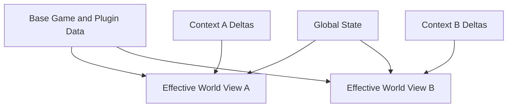
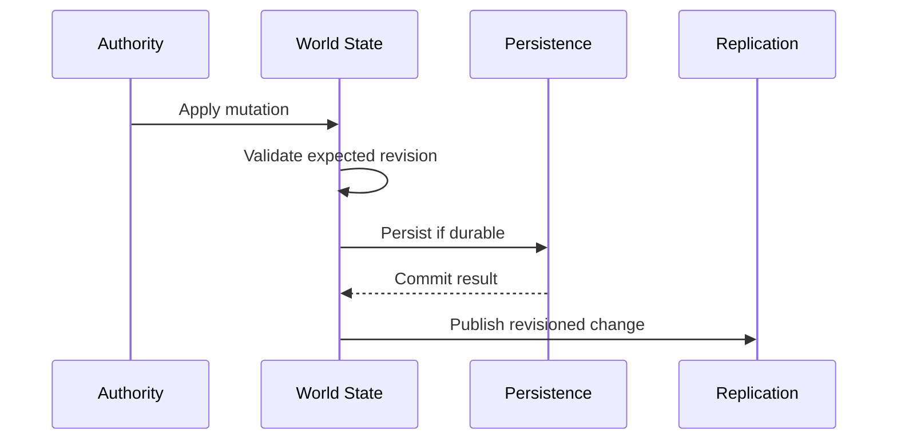

# HTDS-140 — World State

| Field | Value |
| --- | --- |
| Document ID | HTDS-140 |
| Title | World State |
| Version | 0.1.0 |
| Status | Draft Skeleton |
| Maturity | Conceptual / Pre-Implementation |

## 1. Purpose

This document defines the initial hypothesis for Halcyon's server-side World State.

The World State is not intended to reproduce the entire Creation Engine. It should represent only the multiplayer-relevant state required for authority, replication, persistence, validation, and recovery.

## 2. Current Reality

Tilted Evolution already maintains server-side information about connected players, actors, cells, parties, ownership, and replicated gameplay state.

However, much of that state is still shaped around client ownership and message forwarding.

Halcyon's target World State is broader:

- state has explicit authority;
- state may be scoped by Context;
- state is revisioned;
- persistent changes survive reconnect and restart;
- recipients are derived through relevance rather than broad forwarding;
- the server can resolve an effective world view for each Player.

## 3. Responsibilities

The target World State SHOULD provide:

- Entity lookup;
- base Form and Reference identity;
- transforms;
- actor values;
- death and enabled state;
- ownership;
- Context association;
- state revisions;
- scoped Change Forms;
- spawn and despawn;
- publication of accepted mutations;
- snapshot creation;
- recovery support.

The World State SHOULD NOT:

- execute the full Skyrim AI simulation;
- reproduce all Havok behavior;
- run every Papyrus script immediately;
- assume all client observations are valid;
- store presentation-only UI state unless persistence requires it.

## 4. Conceptual Model



The effective state for one recipient is conceptually:

```text
Base Game Data
+ Global Authoritative State
+ Active Context State
+ Session-Specific Ephemeral State
= Effective World View
```

This is a design model, not necessarily the implementation algorithm.

## 5. State Categories

### 5.1 Base State

State derived from Skyrim and the configured plugin set.

Examples:

- actor definitions;
- placed references;
- base inventory;
- cell placement;
- default enabled state;
- faction metadata;
- quest metadata.

### 5.2 Global State

Server-owned state intended to be shared broadly.

Examples:

- connected Players;
- public-event Entities;
- server-wide rules;
- public weather, if configured globally;
- public PvP state;
- global server-created objects.

### 5.3 Context State

State isolated to one Context.

Examples:

- quest-critical actor death;
- party dungeon state;
- personal branch decision;
- Runtime Quest progress;
- instanced containers;
- Context-specific enabled references.

### 5.4 Session State

Ephemeral state associated with one live connection.

Examples:

- connection latency;
- negotiated capabilities;
- pending acknowledgements;
- current subscriptions;
- rate-limit counters.

Session State should not be confused with persistent Player state.

### 5.5 Derived State

State calculated from authoritative inputs rather than stored independently.

Examples:

- effective visibility;
- recipient lists;
- event eligibility;
- resolved Context view;
- current replication priority.

## 6. State Identity

Every durable or replicated state item should have stable identity.

Potential identity components include:

```cpp
struct StateKey
{
    ContextId context;
    EntityId entity;
    StateComponentType component;
};
```

For plugin-defined references, the World State should eventually use a normalized identity rather than only a runtime load-order-dependent FormID.

## 7. Revisions

State should be revisioned to support:

- stale-update rejection;
- delta generation;
- reconnect recovery;
- conflict detection;
- persistence ordering;
- diagnostics.

Revisions may exist at several levels:

- global world revision;
- Context revision;
- Entity revision;
- component revision;
- persistence transaction revision.

The final granularity should be selected through profiling and prototype results.

## 8. Mutations

All accepted authoritative changes should be expressed as mutations.

Conceptual mutation:

```cpp
struct WorldMutation
{
    MutationId id;
    ContextId context;
    EntityId entity;
    MutationType type;
    Revision expectedRevision;
    SerializedPayload payload;
    MutationSource source;
};
```

Potential sources:

- validated client Intent;
- trusted server subsystem;
- Runtime Quest;
- Game Mode;
- administrator command;
- recovery process.

Mutations should be validated before application.

## 9. Effective State Resolution

The server may need to resolve multiple state layers.

Example:

```text
Paarthurnax Base State:
alive

Global State:
no override

Party Context 42:
dead = true

Personal Context 91:
no override
```

A member of Party Context 42 receives `dead = true`.

A solo Player in Personal Context 91 receives the base state, `alive`.

The resolution algorithm must define precedence explicitly.

Possible precedence hypothesis:

```text
Session Override
> Active Instance Context
> Active Party or Personal Narrative Context
> Global Authoritative State
> Base Game Data
```

This ordering is not yet accepted architecture.

## 10. State Components

The World State may use component-oriented storage.

Potential components include:

- `TransformState`;
- `ActorValueState`;
- `LifeState`;
- `InventoryState`;
- `EquipmentState`;
- `AnimationState`;
- `ReferenceState`;
- `OwnershipState`;
- `QuestLinkState`;
- `ContextBindingState`.

Component-oriented state may reduce unnecessary replication and persistence.

The final implementation may remain class-oriented if that better fits the existing codebase.

## 11. Snapshots

The World State should support snapshots for:

- initial connection;
- reconnect;
- Context transition;
- revision-gap recovery;
- server migration;
- diagnostics.

A snapshot should identify:

- included Contexts;
- included Entities;
- base revision;
- final revision;
- schema or capability version.

Large snapshots may need chunking.

## 12. State Publication

Accepted mutations should produce state-change events.

Conceptual flow:



Whether persistence occurs before replication depends on the durability requirement.

## 13. Durability Classes

Potential durability classes:

- **Ephemeral** — safe to lose on restart;
- **Recoverable** — can be reconstructed;
- **Durable** — must survive restart;
- **Critical Durable** — must commit before acknowledgement.

Examples:

| State | Suggested class |
| --- | --- |
| Movement sample | Ephemeral |
| Public event timer | Recoverable or Durable |
| Party membership | Durable |
| Bounty reward | Critical Durable |
| Runtime Quest progress | Durable |
| UI window position | Client-local |

These classifications require dedicated subsystem review.

## 14. World-State Boundaries

The World State should not become a universal dumping ground.

Domain-specific state may belong to:

- Party Service;
- Runtime Quest Service;
- Persistence metadata;
- Plugin Host;
- Admin Service.

The World State should own multiplayer world representation, not every server feature.

## 15. Concurrency

The World State requires deterministic mutation ordering.

Potential approaches:

- single authoritative mutation thread;
- partitioned Context workers;
- Entity mailboxes;
- transactional locks;
- command queues.

The first implementation should favor correctness and traceability over maximum parallelism.

## 16. Recovery

On restart, recovery may:

1. load base plugin data;
2. load durable global state;
3. load Context descriptors;
4. load scoped Change Forms;
5. restore Runtime Quests;
6. validate schema and plugin manifest;
7. accept Sessions;
8. send snapshots.

The server should not accept gameplay before critical recovery completes.

## 17. Diagnostics

World-state diagnostics should expose:

- Entity identity;
- Context;
- authority mode;
- owner;
- revision;
- persistence status;
- last mutation source;
- effective-state resolution;
- replication subscribers.

An administrator should be able to inspect why two Players see different state.

## 18. Initial Prototype

The first prototype should implement only:

- one Context-scoped actor life state;
- one revision;
- one persistent delta;
- one effective-state resolver;
- one reconnect snapshot.

The prototype should not attempt to model the entire world.

## 19. Open Questions

- Should state be component-oriented or class-oriented?
- How should base plugin references map to Entity IDs?
- Can one Entity have several Context-specific variants?
- How should Context precedence work?
- Which revisions are required?
- Should mutations be event-sourced?
- How should temporary spawned Entities be identified?
- What is the smallest useful server-side World State?
- Which existing Tilted Evolution services can be adapted directly?

## 20. Implementation Status

```text
Target World State: Not implemented
Existing server state: Implemented through Tilted Evolution services
Context-scoped state: Not implemented
Revisioned mutation model: Not implemented as specified
Effective-state resolver: Not implemented
Snapshot recovery: Partially exists in legacy forms, not implemented as specified
```
