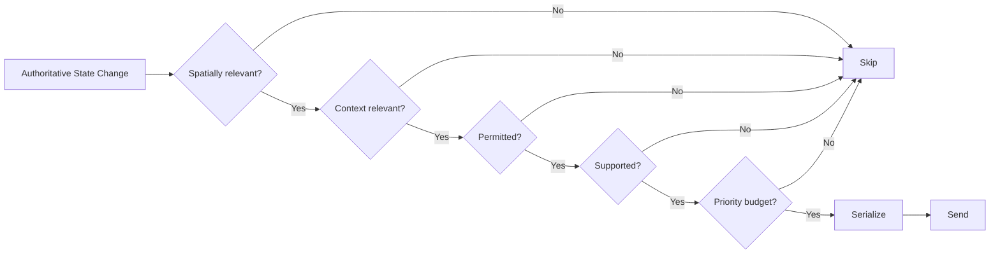

# HTDS-160 — Replication and Relevance

| Field | Value |
| --- | --- |
| Document ID | HTDS-160 |
| Title | Replication and Relevance |
| Version | 0.1.0 |
| Status | Draft Skeleton |
| Maturity | Conceptual / Existing Legacy Foundation |

## 1. Purpose

This document defines the initial target model for deciding which authoritative state is sent to which clients.

Replication is where Halcyon's shared physical world and isolated narrative state meet.

## 2. Current Reality

Tilted Evolution already replicates players, actors, inventory, actor values, parties, chat, and other gameplay state.

Current recipient selection and ownership behavior must be mapped through code analysis.

Halcyon intends to add Context-aware relevance without destroying existing spatial synchronization.

## 3. Replication Goal

A recipient should receive a state update only when:

```text
the state is spatially relevant
AND contextually relevant
AND permitted
AND supported
AND worth sending within the current budget
```

Conceptual function:

```cpp
ReplicationDecision Evaluate(
    const ReplicationEvent& event,
    const SessionDescriptor& recipient);
```

## 4. Relevance Dimensions

### 4.1 Spatial Relevance

Potential inputs:

- cell;
- worldspace;
- distance;
- loaded area;
- interior membership;
- explicit visibility.

### 4.2 Contextual Relevance

Potential inputs:

- Context membership;
- Context compatibility;
- active narrative instance;
- Party membership;
- event enrollment;
- Personal Context.

### 4.3 Permission Relevance

Potential inputs:

- administrator visibility;
- private event access;
- moderation state;
- spectator permission;
- PvP rules.

### 4.4 Capability Relevance

The recipient must support the required message or behavior.

### 4.5 Priority Relevance

The update must fit within processing and bandwidth budgets.

## 5. Replication Pipeline



This pipeline may be optimized or reordered.

## 6. Replication Event

Conceptual event:

```cpp
struct ReplicationEvent
{
    EventId id;
    ContextId context;
    EntityId entity;
    StateComponentType component;
    Revision revision;
    ReplicationPriority priority;
    DurabilityClass durability;
};
```

The payload may be produced after recipient filtering to support capability-specific serialization.

## 7. Subscriptions

A Session may subscribe to:

- nearby cells;
- Party state;
- active Contexts;
- accepted Runtime Quests;
- public events;
- administrative channels;
- diagnostics.

Subscriptions should be explicit where practical.

## 8. Shared Players Across Contexts

Players should normally remain visible across narrative Contexts when safe.

Example:

```text
Player A: Party Context 42
Player B: Personal Context 91

Both:
- occupy the same exterior cell;
- see each other;
- can chat;
- may use PvP.

Quest Actor:
- appears dead to A;
- appears alive to B.
```

This requires Entity-level or component-level contextual relevance.

## 9. Full Phasing

Some scenes may be too incompatible for shared visibility.

Examples:

- scripted scenes using the same actors;
- mutually exclusive large battles;
- incompatible city states;
- cell-wide quest transformations.

In these cases, the server may isolate:

- quest actors;
- all non-player Entities;
- or the entire cell.

The least disruptive safe isolation should be preferred.

## 10. Snapshots

Snapshots should be used for:

- initial connection;
- Context entry;
- reconnect;
- revision recovery;
- large state replacement.

Snapshot scope should be explicit.

Examples:

- one Entity;
- one Context;
- one cell;
- one Player profile.

## 11. Deltas

Delta updates should identify the state they build on.

Potential fields:

- base revision;
- new revision;
- component mask;
- changed values.

Clients detecting a revision gap should request resynchronization.

## 12. Priority Classes

Potential classes:

- critical gameplay;
- authoritative actor state;
- interaction state;
- movement;
- animation;
- cosmetic;
- diagnostics.

Movement may be frequent but replaceable.

A reward commit may be rare but critical.

## 13. Bandwidth Management

Potential strategies:

- distance-based rate reduction;
- delta compression;
- coalescing;
- last-value replacement;
- interest regions;
- per-Session budgets;
- lower rates for low-priority Entities;
- snapshot compression.

Optimization should follow measurement.

## 14. Ordering

Some updates require ordering.

Examples:

- spawn before component updates;
- Context membership before scoped state;
- reward commit before completion notification;
- snapshot before subsequent deltas.

The protocol should define ordering requirements explicitly.

## 15. Ownership and Replication

Ownership determines who may produce certain updates.

Replication determines who receives accepted updates.

These concerns should not be conflated.

A client owner may report movement, but the server selects recipients.

## 16. Legacy Compatibility

Potential compatibility behavior:

- legacy clients receive only Global Context state;
- Context-specific features require negotiated capability;
- Halcyon servers may disable unsafe narrative isolation for legacy clients;
- strict public-server mode may reject legacy clients.

No compatibility mode should silently expose private Context state.

## 17. Diagnostics

Replication diagnostics should answer:

- why was an update sent;
- why was it skipped;
- which Context applied;
- which revision was used;
- how many recipients were eligible;
- how much bandwidth was consumed;
- whether the recipient supported the capability.

## 18. Initial Prototype

The first prototype should:

1. identify two Players in the same cell;
2. keep Player replication global;
3. attach one actor-state update to Context A;
4. send it only to members of Context A;
5. verify Context B does not receive it;
6. reconnect and restore correct state.

## 19. Open Questions

- Should Context filtering happen before or after spatial filtering?
- How should players in several active Contexts resolve overlap?
- Can individual components have different Context scope?
- How should exterior phasing interact with AI?
- What is the cost of per-recipient effective-state resolution?
- Can existing replication services be extended incrementally?
- What snapshot granularity is practical?

## 20. Implementation Status

```text
Legacy replication: Implemented
Spatial/cell-based behavior: Implemented in existing form
Context relevance: Not implemented
Revision-gap recovery: Not implemented as specified
Capability-aware serialization: Not implemented as specified
Per-Context snapshots: Not implemented
```
