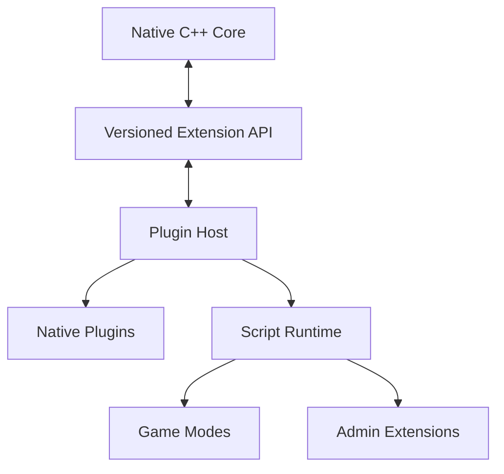

# HTDS-180 — Plugin Host

| Field | Value |
| --- | --- |
| Document ID | HTDS-180 |
| Title | Plugin Host |
| Version | 0.1.0 |
| Status | Draft Skeleton |
| Maturity | Conceptual / Pre-Implementation |

## 1. Purpose

This document defines the initial target for Halcyon's extension host.

The Plugin Host is intended to let server operators add game modes, runtime quests, events, economy rules, factions, administrative commands, and other high-level systems without repeatedly modifying the native multiplayer core.

## 2. Current Reality

No stable Halcyon plugin API exists yet.

Tilted Evolution provides native services and internal extension points, but these are not a versioned public SDK.

The first Halcyon implementation may expose only native internal interfaces while the long-term scripting model is evaluated.

## 3. Goals

The Plugin Host SHOULD provide:

- versioned APIs;
- event subscriptions;
- controlled World State access;
- Context creation and membership APIs;
- Runtime Quest APIs;
- command registration;
- persistence access through approved abstractions;
- lifecycle management;
- error isolation;
- diagnostics;
- development reload where safe.

## 4. Non-Goals

The first Plugin Host does not need to provide:

- arbitrary memory access;
- arbitrary client code execution;
- unrestricted SQL access;
- ABI stability across every development commit;
- full Papyrus compatibility;
- hot reload for native C++ modules.

## 5. Proposed Layers



## 6. Native Core Boundary

The native core should retain responsibility for:

- transport;
- protocol;
- authority;
- World State;
- Contexts;
- replication;
- persistence primitives;
- security boundaries;
- game-data access.

Plugins should not bypass these systems.

## 7. Event Model

Plugins may subscribe to accepted domain events.

Examples:

```cpp
struct PlayerConnectedEvent;
struct PlayerDisconnectedEvent;
struct ContextEnteredEvent;
struct EntityKilledEvent;
struct RuntimeQuestCompletedEvent;
struct BountyClaimedEvent;
```

Events should represent accepted state, not raw unvalidated client messages.

## 8. Command Model

Plugins may register:

- player chat commands;
- administrator commands;
- console commands;
- scheduled jobs.

Command handlers should receive validated identity and permission context.

## 9. World Access

Plugins should use constrained APIs.

Example:

```ts
const actor = world.getEntity(actorId);
const event = runtimeQuests.create(template);
contexts.addMember(contextId, playerId);
```

The API should reject illegal mutations rather than expose raw pointers or storage internals.

## 10. Persistence

Plugins may need durable custom state.

Preferred approaches:

- namespaced key-value storage;
- typed plugin schemas;
- versioned migrations;
- domain-specific persistence APIs.

Plugins should not create untracked tables without registration.

## 11. Script Runtime

TypeScript is the current leading candidate because it offers:

- accessible contribution;
- static typing;
- modern tooling;
- fast iteration;
- compatibility with server-side event-driven gameplay.

This decision is not final.

Alternatives include Lua, JavaScript, WebAssembly, or native-only APIs.

## 12. Isolation

A plugin failure should not normally terminate the server.

Possible controls:

- exception boundaries;
- execution budgets;
- memory limits;
- timeouts;
- restricted filesystem access;
- restricted networking;
- worker processes;
- capability-based APIs.

The first implementation may provide weaker isolation and clearly document it.

## 13. Versioning

The Plugin Host should distinguish:

- server build version;
- plugin API version;
- script runtime version;
- plugin manifest version;
- plugin data schema version.

Plugins should declare compatible ranges.

## 14. Plugin Manifest

Conceptual manifest:

```json
{
  "id": "halcyon.example.bounties",
  "version": "0.1.0",
  "apiVersion": "1",
  "entrypoint": "dist/index.js",
  "permissions": [
    "contexts.read",
    "runtimeQuests.write",
    "rewards.write"
  ]
}
```

This format is illustrative.

## 15. Security

Plugin permissions should be explicit.

Potential capabilities:

- read World State;
- mutate approved Entity components;
- create Contexts;
- create Runtime Quests;
- grant rewards;
- register commands;
- access HTTP;
- access filesystem;
- access administrative APIs.

High-risk capabilities should require operator approval.

## 16. Lifecycle

Potential lifecycle:

1. discover;
2. validate manifest;
3. validate API compatibility;
4. load;
5. initialize;
6. subscribe;
7. run;
8. stop accepting work;
9. persist;
10. unload.

## 17. Development Experience

The SDK should eventually provide:

- type definitions;
- examples;
- local test harness;
- mock server APIs;
- validation tool;
- packaging tool;
- documentation;
- compatibility checks.

## 18. Initial Prototype

The first plugin prototype should:

- register one server command;
- subscribe to one accepted domain event;
- create one Runtime Quest;
- persist one namespaced value;
- survive a script exception without stopping the server.

## 19. Open Questions

- Which runtime should be selected?
- In-process or worker process?
- How are async operations handled?
- Can plugins define protocol messages?
- Can plugins add client UI safely?
- How are API permissions enforced?
- How are plugin migrations rolled back?
- How much SkyMP game-mode architecture can be reused?

## 20. Implementation Status

```text
Stable Plugin Host: Not implemented
Public Plugin API: Not implemented
TypeScript runtime: Not implemented
Native internal extension points: Exist through current codebase
Plugin isolation: Not implemented
Plugin persistence: Not implemented
```
