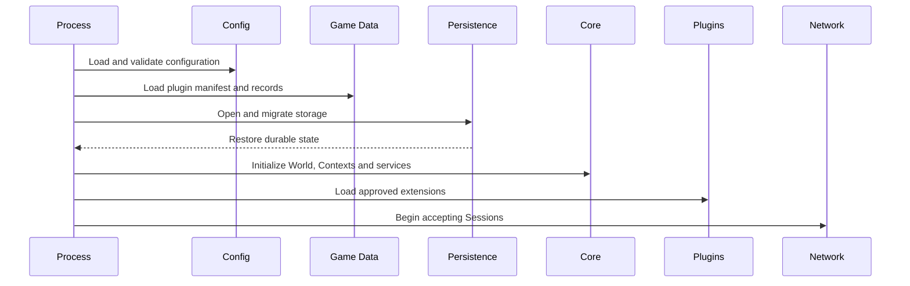

# HTDS-190 — Runtime and Lifecycle

| Field | Value |
| --- | --- |
| Document ID | HTDS-190 |
| Title | Runtime and Lifecycle |
| Version | 0.1.0 |
| Status | Draft Skeleton |
| Maturity | Conceptual / Existing Foundation |

## 1. Purpose

This document outlines Halcyon's process lifecycle, startup sequence, runtime phases, shutdown behavior, and recovery expectations.

## 2. Runtime Components

The initial system consists of:

- one Skyrim client process per Player;
- Halcyon client payload and native UI;
- one dedicated server process;
- one persistence backend;
- optional game-mode or plugin runtime;
- optional administrative tools.

## 3. Server Startup

Conceptual sequence:



The server should not accept normal gameplay before critical recovery succeeds.

## 4. Runtime Phases

Potential phases:

- bootstrapping;
- recovering;
- ready;
- degraded;
- read-only;
- draining;
- shutting down;
- stopped.

These phases may be exposed through health checks.

## 5. Client Startup

The current Linux/Proton path includes:

- launcher startup;
- Skyrim process creation;
- protected image restoration;
- payload injection;
- client initialization;
- network connection;
- save or new-game load;
- native UI activation.

Future Context reconciliation should occur only after both game runtime and network state are ready.

## 6. Connection Lifecycle

Potential Session flow:

1. transport connection;
2. protocol handshake;
3. authentication;
4. capability negotiation;
5. mod-manifest validation;
6. Player restoration;
7. Context restoration;
8. authoritative snapshot;
9. active gameplay;
10. disconnect or reconnect grace period.

## 7. Context Lifecycle

Potential states:

```text
Created
Preparing
Active
Suspended
Completing
Completed
Expired
Archived
Deleted
```

Not every Context requires every state.

## 8. Entity Lifecycle

Potential Entity lifecycle:

```text
Known
Created
Spawned
Active
Dormant
Despawned
Destroyed
Tombstoned
```

The client-visible spawn lifecycle and server persistence lifecycle should remain distinct.

## 9. Runtime Quest Lifecycle

Potential states:

```text
Draft
Scheduled
Active
Completed
Failed
Expired
Cancelled
Archived
```

Transitions must be server-owned.

## 10. Reconnect

A reconnect should:

- authenticate the same Player;
- invalidate or replace the old Session;
- restore Party and Context membership;
- send authoritative snapshots;
- reject stale local state;
- resume eligible Runtime Quests.

## 11. Grace Periods

The server may retain temporary state after disconnect.

Examples:

- Party membership;
- combat Entity;
- bounty eligibility;
- active Runtime Quest participation;
- Session replacement token.

Grace periods must not allow duplicated active Sessions or reward exploits.

## 12. Degraded Operation

Possible degraded modes:

- read-only persistence;
- plugins disabled;
- public events paused;
- new Sessions rejected;
- one Context quarantined;
- admin-only mode.

The server should expose the reason clearly.

## 13. Graceful Shutdown

Conceptual sequence:

1. stop accepting new Sessions;
2. mark server draining;
3. notify clients;
4. stop new Runtime Quests;
5. complete or suspend durable operations;
6. flush persistence;
7. unload plugins;
8. close transport;
9. exit.

## 14. Crash Recovery

After an unexpected stop, the server should:

- verify schema;
- inspect incomplete durable operations;
- restore last committed revisions;
- avoid replaying rewards twice;
- recover active Contexts;
- resume or expire Runtime Quests according to policy.

## 15. Time

The runtime should distinguish:

- wall-clock time;
- monotonic process time;
- Skyrim game time;
- event schedule time;
- persistence timestamps.

Gameplay timeouts should not rely on wall-clock behavior that can move backward.

## 16. Scheduling

The server may need scheduled tasks for:

- event activation;
- bounty expiry;
- Context cleanup;
- persistence checkpoints;
- plugin timers;
- maintenance.

Scheduling should survive restart when tasks are durable.

## 17. Tick Model

No final simulation tick model is selected.

Potential systems may use:

- transport callbacks;
- fixed server ticks;
- scheduled jobs;
- event-driven processing;
- per-Context update loops.

The architecture should not introduce a high-frequency global tick without evidence.

## 18. Health and Readiness

Potential checks:

- process alive;
- persistence writable;
- plugin data loaded;
- World State recovered;
- network listening;
- plugin host healthy;
- migration complete.

Readiness and liveness should be separate.

## 19. Initial Runtime Prototype

The first lifecycle prototype should demonstrate:

- startup recovery of one Context;
- Session authentication;
- Context snapshot;
- disconnect;
- reconnect with new Session;
- graceful shutdown;
- restart with restored state.

## 20. Open Questions

- How long should reconnect grace last?
- Should Party membership survive long disconnects?
- How are active events resumed after downtime?
- Should one failed plugin block readiness?
- Which state is checkpointed?
- Is a fixed server tick required?
- How are server upgrades coordinated with clients?

## 21. Implementation Status

```text
Existing server/client lifecycle: Implemented through Tilted Evolution
Context lifecycle: Not implemented
Runtime Quest lifecycle: Not implemented
Readiness states: Not implemented as specified
Durable scheduling: Not implemented
Graceful authoritative recovery: Not implemented as specified
```
