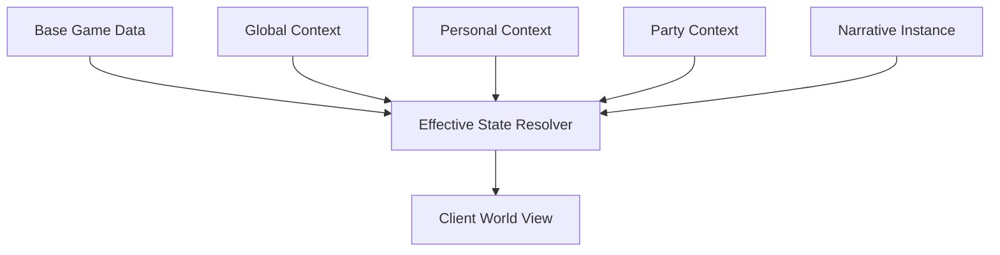

# HTDS-200 — Context System Overview

| Field | Value |
| --- | --- |
| Document ID | HTDS-200 |
| Title | Context System Overview |
| Version | 0.1.0 |
| Status | Draft Skeleton |
| Maturity | Conceptual / Pre-Implementation |

## 1. Purpose

This document defines the initial architecture hypothesis for Halcyon's Context system.

A Context is a logical scope used to select, isolate, own, replicate, and persist multiplayer state.

## 2. Problem

A public Skyrim server must allow several Players and Parties to occupy the same world without forcing all of them to share one narrative state.

Examples:

- one Party has killed a quest-critical Actor;
- another Party still needs that Actor alive;
- one Player is progressing alone;
- another Player joins a public event;
- two Parties enter the same dungeon at different quest stages;
- PvP remains enabled between Players whose quests are isolated.

Without a common state-scope abstraction, these cases become unrelated special systems.

## 3. Context Definition

Conceptually, a Context contains:

```cpp
struct ContextDescriptor
{
    ContextId id;
    ContextType type;
    ContextLifecycleState lifecycle;
    ContextPolicy policy;
    Revision revision;
};
```

A Context may additionally reference:

- members;
- roles;
- parent or source state;
- scoped Entities;
- scoped Change Forms;
- Runtime Quests;
- persistence rules;
- expiry;
- replication policy.

This is not a stable API.

## 4. Context Responsibilities

The Context system should eventually provide:

- creation;
- identification;
- membership;
- transition;
- lifecycle;
- state ownership;
- conflict detection;
- replication scope;
- persistence scope;
- cleanup;
- diagnostics.

## 5. Contexts Are Not Automatically Instances

A Context does not necessarily create:

- a separate process;
- a separate worldspace;
- a copied cell;
- duplicated Players;
- duplicated base data.

A Context may isolate only one component of one Entity.

Example:

```text
Player A and Player B remain visible to each other.

Paarthurnax life state:
- Context A: dead
- Context B: alive
```

Full cell instancing should be used only when finer-grained isolation is unsafe.

## 6. Contexts and Effective World View



A Player may participate in several Contexts simultaneously.

The resolver must determine which state applies.

## 7. Primary Context Uses

### Personal progression

Solo quest state and personal decisions.

### Party progression

Shared cooperative campaign state.

### Narrative isolation

Branch-specific or Actor-specific state.

### Dungeon isolation

Scoped dungeon enemies, doors, puzzles, and loot.

### Runtime Quests

Server-created objectives and event state.

### Public Events

Shared participation without Party membership.

### Administrative or scripted scenarios

Temporary server-defined scopes.

## 8. Context Identity

Context IDs should be server-issued and stable for the lifetime required by persistence.

A Context ID must not be derived only from:

- Party leader;
- Session;
- quest FormID;
- cell;
- temporary client owner.

Those values may change while the Context remains valid.

## 9. Context State Ownership

State associated with a Context should identify:

- Context ID;
- Entity or logical object;
- component;
- revision;
- durability;
- mutation source.

## 10. Context Participation

Participation may include:

- full member;
- guest;
- observer;
- administrator;
- event participant;
- spectator.

The initial prototype may support only full membership.

## 11. Context Composition

A Player's effective state may combine several active Contexts.

Possible layers:

```text
Global
+ Personal
+ Party
+ Active Narrative Instance
+ Runtime Event
```

Composition and precedence require explicit rules.

## 12. Context Conflict

A conflict occurs when two active Contexts define incompatible values for the same state.

Examples:

- one Context says Actor alive;
- another says Actor dead;
- one quest branch enables a door;
- another disables it;
- two Runtime Quests claim exclusive control of one Actor.

Conflicts must not be resolved accidentally by message arrival order.

## 13. Context Scope

Potential scope granularity:

- quest;
- Actor;
- Reference;
- component;
- cell;
- dungeon;
- event;
- Party;
- whole Personal world view.

Smaller scopes preserve more shared-world behavior but may be harder to implement safely.

## 14. Context Security

The server must validate:

- who may create a Context;
- who may join;
- who may mutate Context state;
- who may observe state;
- who may complete or destroy the Context;
- which plugin may access it.

## 15. First Prototype Boundary

RFC-0001 defines the first prototype:

- two Personal Contexts;
- one shared cell;
- globally visible Players;
- one Context-scoped Actor life state;
- persistence across restart.

No quest stages or Party merging are required.

## 16. Open Questions

- Are Contexts hierarchical?
- Can one Entity have several Context variants?
- Can a Player be a full member of several narrative Contexts?
- What is the precedence model?
- How are Personal and Party states reconciled?
- Should Runtime Quests always create Contexts?
- How are Contexts indexed efficiently?
- How does local Skyrim state react to fast Context transitions?

## 17. Implementation Status

```text
General Context system: Not implemented
Party-related scoping: Exists in legacy-specific forms
Context IDs in protocol: Not implemented
Effective-state resolution: Not implemented
Context persistence: Not implemented
```
