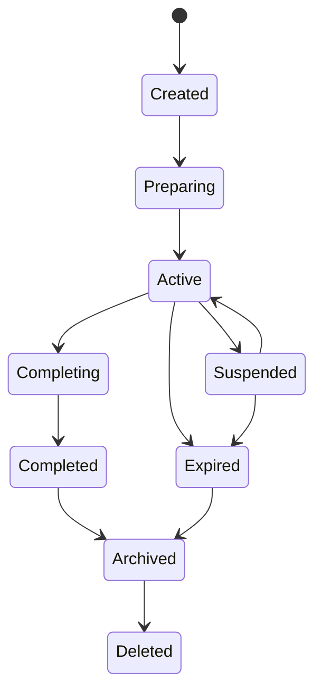

# HTDS-220 — Context Lifecycle

| Field | Value |
| --- | --- |
| Document ID | HTDS-220 |
| Title | Context Lifecycle |
| Version | 0.1.0 |
| Status | Draft Skeleton |
| Maturity | Conceptual / Pre-Implementation |

## 1. Purpose

This document proposes Context lifecycle states and transitions.

Lifecycle determines when a Context can accept members, mutate state, replicate state, persist, complete, expire, or be removed.

## 2. Proposed States

```cpp
enum class ContextLifecycleState
{
    Created,
    Preparing,
    Active,
    Suspended,
    Completing,
    Completed,
    Expired,
    Archived,
    Deleted
};
```

Not every Context must use every state.

## 3. State Diagram



## 4. Created

The Context has identity but may not yet have:

- resolved policy;
- loaded base state;
- participants;
- spawned Entities;
- persistence record.

## 5. Preparing

The server is loading or creating required state.

Examples:

- validating plugin data;
- loading a dungeon;
- creating Runtime Quest objectives;
- restoring scoped changes.

Players should not receive an incomplete Context snapshot.

## 6. Active

The Context may:

- accept allowed members;
- process mutations;
- replicate state;
- run timers;
- progress objectives;
- persist changes.

## 7. Suspended

The Context remains valid but active gameplay is paused.

Possible reasons:

- no members online;
- server maintenance;
- plugin failure;
- required cell unavailable;
- event schedule pause.

Suspension policy must define timer behavior.

## 8. Completing

The Context is finalizing:

- objective state;
- rewards;
- persistence;
- participant results;
- cleanup.

New ordinary mutations should normally be rejected.

## 9. Completed

The Context reached its successful terminal result.

It may remain available for:

- result display;
- reward retrieval;
- audit;
- progress commit;
- reconnect inspection.

## 10. Expired

The Context ended without ordinary completion.

Examples:

- event timeout;
- abandoned temporary instance;
- invalidated server scenario.

Expiry should not automatically delete audit or reward state.

## 11. Archived

The Context is inactive and retained for history or recovery.

Large ephemeral state may be compacted.

## 12. Deleted

The Context is removed from active storage.

Deletion may create a tombstone rather than immediate physical removal.

## 13. Creation

Context creation should validate:

- creator permission;
- type;
- policy;
- base data;
- parent or source state;
- persistence requirements;
- client capabilities.

## 14. Activation

Before activation, the server should ensure:

- state is prepared;
- required persistence exists;
- policy is valid;
- members can receive required behavior;
- conflicts are resolved or isolated.

## 15. Suspension

Suspension should define:

- whether members remain assigned;
- whether timers stop;
- whether Entities remain visible;
- whether mutations are queued or rejected;
- whether reconnect is allowed.

## 16. Completion

Completion may be initiated by:

- Runtime Quest success;
- quest branch resolution;
- administrator action;
- plugin logic;
- Party decision;
- system policy.

Critical rewards should persist before success is acknowledged.

## 17. Cleanup

Cleanup may remove:

- ephemeral Entities;
- subscriptions;
- temporary commands;
- timers;
- caches;
- client UI state.

Durable state should remain according to policy.

## 18. Restart Recovery

After restart:

- Active Contexts may resume;
- Suspended Contexts remain suspended;
- Completing Contexts require transaction recovery;
- Completed or Expired Contexts may archive;
- invalid Contexts may be quarantined.

## 19. Lifecycle Events

Potential events:

```cpp
ContextCreatedEvent;
ContextActivatedEvent;
ContextSuspendedEvent;
ContextCompletedEvent;
ContextExpiredEvent;
ContextArchivedEvent;
```

## 20. Initial Prototype

The first prototype requires only:

```text
Created
Active
Archived
```

The full lifecycle should not block RFC-0001.

## 21. Open Questions

- Should Contexts auto-suspend when empty?
- How are timers handled during downtime?
- Can an Archived Context reactivate?
- Who may complete or delete a Context?
- How are half-completed reward transactions recovered?
- When should Context state be compacted?

## 22. Implementation Status

```text
Lifecycle states: Not implemented
Recovery policy: Not implemented
Context timers: Not implemented
Archival: Not implemented
```
