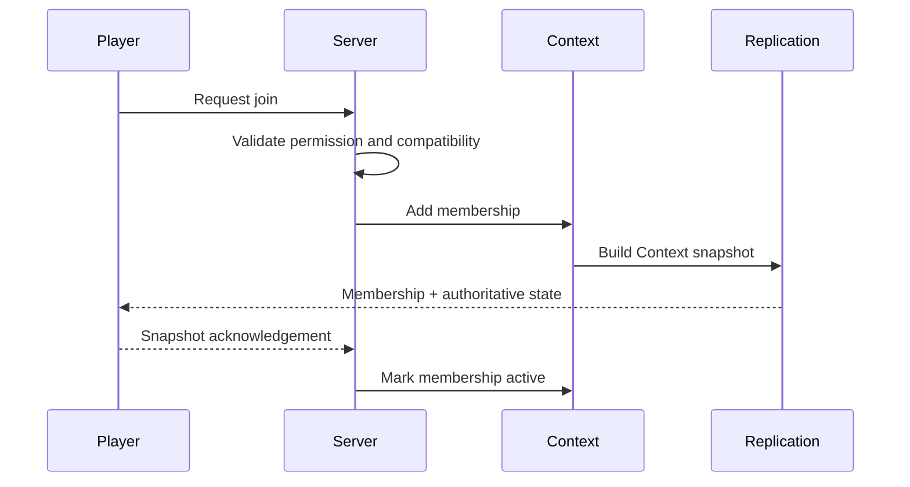

# HTDS-230 — Membership and Transitions

| Field | Value |
| --- | --- |
| Document ID | HTDS-230 |
| Title | Membership and Transitions |
| Version | 0.1.0 |
| Status | Draft Skeleton |
| Maturity | Conceptual / Pre-Implementation |

## 1. Purpose

This document proposes how Players and Sessions participate in Contexts.

Membership controls eligibility, visibility, mutation permissions, snapshots, and restoration.

## 2. Persistent Member Versus Live Session

A Player may remain a Context member while offline.

A Session is the current live connection used to receive state.

Therefore membership should attach primarily to Player or Character identity, not only to Session.

## 3. Proposed Membership Record

```cpp
struct ContextMembership
{
    ContextId context;
    PlayerId player;
    ContextRole role;
    MembershipState state;
    Revision revision;
};
```

This is illustrative.

## 4. Roles

Potential roles:

- owner;
- leader;
- member;
- guest;
- observer;
- spectator;
- administrator;
- event participant.

Roles should define permissions through policy rather than hidden code branches.

## 5. Membership States

Potential states:

```text
Invited
Joining
Active
Suspended
Leaving
Left
Removed
Banned
```

The first prototype may use only Active and Left.

## 6. Join Flow



## 7. Leave Flow

Leaving may require:

- stopping Context mutations;
- resolving progress commit;
- removing subscriptions;
- restoring previous effective state;
- persisting membership change;
- updating Party state.

## 8. Party Join

Joining a Party should not immediately overwrite Personal progression.

Possible future modes:

- follow Party Context temporarily;
- guest progression;
- safe compatible commit;
- explicit permanent adoption;
- reject incompatible quest activation.

The default must be conservative.

## 9. Party Leave

On leaving a Party:

- Party Context state remains with the Party;
- Personal Context remains available;
- compatible progress may be committed according to policy;
- incompatible state must not be merged automatically;
- client effective state must be restored safely.

## 10. Guest Membership

A guest may:

- observe Party state;
- participate in combat;
- contribute to objectives;
- avoid automatic Personal progress changes.

Guest membership is not required for the first prototype.

## 11. Multi-Context Membership

A Player may simultaneously belong to:

- Global Context;
- Personal Context;
- Party Context;
- Public Event Context;
- Narrative Instance.

The effective-state resolver must distinguish membership from precedence.

## 12. Transition Atomicity

A Context transition should not leave a Player half-subscribed.

Potential transaction:

1. validate destination;
2. persist membership;
3. prepare snapshot;
4. update subscriptions;
5. apply client transition;
6. acknowledge;
7. release old temporary state.

Exact ordering requires prototype validation.

## 13. Capability Checks

A Player should not join a Context requiring unsupported client behavior.

Examples:

- Context-scoped actor state;
- Runtime Quest UI;
- cell instancing;
- typed client commands.

## 14. Disconnect

Disconnect does not necessarily remove membership.

Policy determines:

- reconnect grace;
- Party retention;
- event eligibility;
- instance lifetime;
- offline expiry.

## 15. Removal and Ban

Context-specific removal should be distinct from server ban.

A Player may be:

- removed from one event;
- blocked from one Party;
- banned from one Context type;
- banned from the server.

## 16. Membership Persistence

Persist when required:

- Context ID;
- Player or Character ID;
- role;
- state;
- revision;
- joined time;
- left time;
- reason;
- inviter or source.

## 17. Initial Prototype

RFC-0001 needs:

- one Global membership;
- one Personal membership per Player;
- restoration after reconnect;
- Context snapshot delivery.

No Party transitions are required initially.

## 18. Open Questions

- Membership belongs to Player or Character?
- Can one Player have several active Party-like Contexts?
- What happens if transition acknowledgement never arrives?
- How is guest contribution committed?
- How are incompatible client capabilities handled?
- How long does offline membership remain active?

## 19. Implementation Status

```text
General Context membership: Not implemented
Party membership: Implemented through legacy Party system
Context transitions: Not implemented
Guest mode: Not implemented
Multi-Context client resolution: Not implemented
```
